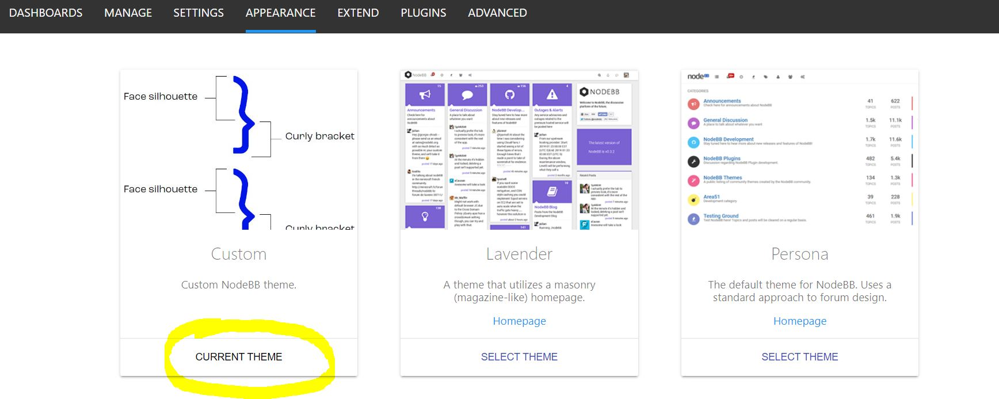
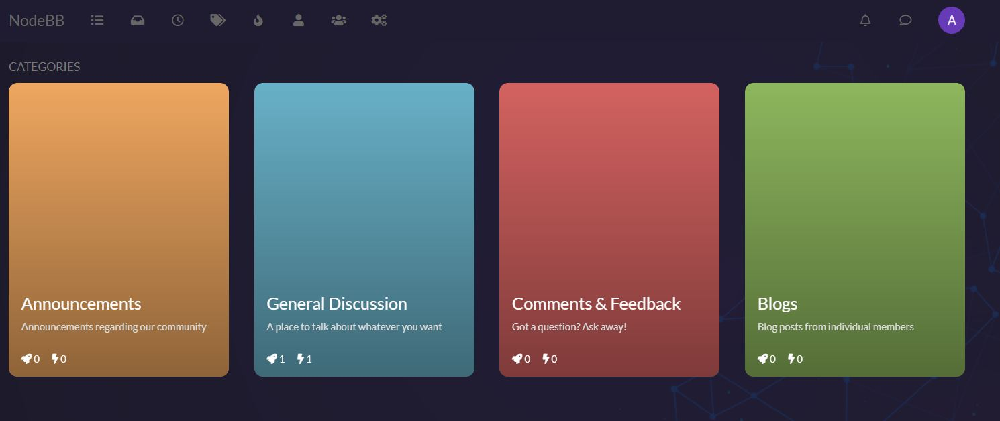

# Forum NodeBB with Custom Theme

[**NodeBB Forum**](//github.com/NodeBB/NodeBB) version using a Custom Theme.

##### [Try Live Open Source](//try.nodebb.org) | [Git Open Source](//github.com/NodeBB/NodeBB) | [Web page](https://nodebb.org) 


## Run in Windows

This version is built starting from  `v1.19.5` with addition of some `external plugins` + a `custom theme`. 


### Requirements
NodeBB requires the following software to be installed:

- `Node.js` version 12 or greater
- `Docker` engine (or MongoDB in your local) 
- `nginx` version 1.3.13 or greater

### MongoDB in Docker 
`docker-compose.yml` has been changed for running only MongoDB inside a docker container.
```
docker-compose up -d
```
### NodeBB in local
The connection to mongo DB is configured in `config.json`
```
nodebb install
```
Should launch the web installer. Insert `username`, `email`, `pwd` and click `Install NodeBB`.  

### Activate Custom theme
Login with the same user/pwd and go to `Admin->Appearance->Themes`
```
http://localhost:4567/admin/appearance/themes
```

Choose the `custom` theme


Click the button in the right upper side of the screen `Rebuild and restart Forum`.<br/>
The forum, should look like this: 




### Build History
No need to execute the following steps, they are listed only for history purposes. 
References are already present in `package.json`.
```
git clone -b v1.19.x https://github.com/NodeBB/NodeBB.git forum-nodebb
cd forum-nodebb

npm install nodebb-plugin-emailer-sendgrid
npm install nodebb-plugin-embed
npm install nodebb-plugin-s3-uploads-digitalocean
npm install nodebb-plugin-share-post-icons
npm install nodebb-theme-timuu
npm install file:custom/nodebb-theme-custom
```


## Links

* [Demo](https://try.nodebb.org)
* [Documentation](//docs.nodebb.org) 
* [How to install NodeBB on Windows](https://docs.nodebb.org/installing/os/windows/)
* [Git NodeBB Open Source](//github.com/NodeBB/NodeBB)

